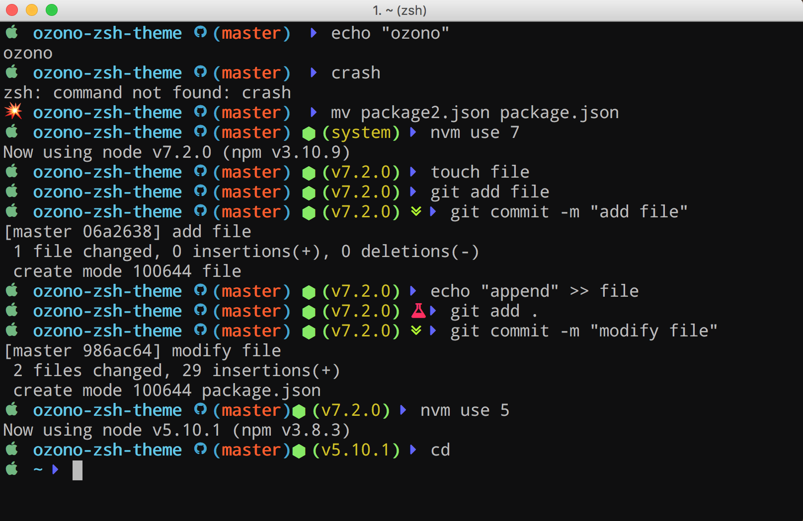

<h1 align="center"> 
  🌏 OZ0NO 🌎 
  <p align="center">Let's Breathe a clean ZSH</p>
</h1>


<p align="center">
  
</p>

> An [“Oh My ZSH!”](http://ohmyz.sh/) theme with sopport for Node.js envs, OS switching, Git Status & some fine tunning for JS enviroments.


## Requirements

For correct work you will first need:

- [“Oh My ZSH!”](http://ohmyz.sh/) must be installed
- [nvm](https://github.com/creationix/nvm) If you want see the node prompt. (Your project need to have a package.json file also)
- [Nerd font](https://github.com/ryanoasis/nerd-fonts) installed on your OS. (Only neccesary for the fancy icons)

# Easy Install

> If you have a standar oh-ny-zsh config this should work fine -> 💫✨

Install using **curl**:

```
curl -o - https://raw.githubusercontent.com/sfabrizio/ozono-zsh-theme/master/install.sh | zsh
```

Install using **wget**:

```
wget -O - https://raw.githubusercontent.com/sfabrizio/ozono-zsh-theme/master/install.sh | zsh
```


# Manual install

> In case that the easy install doesn't work for you -> 💥🙈

1. Download the theme file [here](https://raw.githubusercontent.com/sfabrizio/ozono-zsh-theme/master/ozono-theme.zsh) or just run:

    ```bash
    curl -o - https://raw.githubusercontent.com/sfabrizio/ozono-zsh-theme/master/ozono-theme.zsh
    ```

2. Rename `ozono-theme.zsh` to `ozono-theme.zsh-theme` like this:
    ```bash
    mv ozono-theme.zsh ozono-theme.zsh-theme
    ```

3. Move the `ozono-theme.zsh-theme` file to `$ZSH_CUSTOM/themes/`:

    ```bash
    mv ozono-theme.zsh-theme $ZSH_CUSTOM
    ```

4. Add/edit the line in your `~/.zshrc`: `ZSH_THEME="ozono"`

5. Reload your zsrc config:

    ```bash
    source ~/.zshrc
    ```

# New Features 

Do you feel that ozono need more features? Create an issue! Your ideas are welcome -> 💡s = 😁

If you have any issue please let me know.. I'd like to help -> 🤓

Contributors would be great also! 🙌


# TODO

Uff a lot 😱 but first:

- I need to start to document all the values for a better customization.
- Testing it! for eg. The first icon (mac icon on the preview) change according the OS.. But I didn't test on others OS, It'd be easy add more support on this feature.

## License

ozono-zsh-theme is released under the [MIT license](LICENSE.md).
